=========================
User and Programmer Guide
=========================

This guide involves all the processes that can be performed by final users and
programmers. 

This guide is related to the version 4.4.3 of WMarket, released in September 
2015.


----------
User Guide
----------

WMarket is a software that eases the users the process of looking for the best
offering in different Stores since it aggregates them and all their offerings 
so users can find what they need more easily.

The user guide is divided into two parts: one related to consumers (users 
interested in acquiring offerings) and another one related to providers (users
interested in acquiring and publishing offerings).


Consumers
=========

Users Management
----------------

Registering and Logging In
``````````````````````````

The first step to access WMarket is to create a new user account. This process
may vary depending on the authentication system selected by the WMarket admin. 

If the WMarket instance you are accessing uses an external authentication
system (i.e. FIWARE IdM), you are not required to create a new user account:
you can use the one existing in the IdM. The first time that you access the
instance, you will be redirected to the IdM where you have to introduce your
credentials. Once that you have introduced your credentials, click **Sign in**
(the button indicated by a blue arrow). If you do not have a FIWARE account
yet, you can create a new one by clicking the **Sign up** button (the one 
indicated the by the green arrow).

.. image:: images/user-guide/login-idm.png
   :align: center

On the other hand, if you are using the local authentication system, when you
access the instance and you are not logged in, a log in dialog will be 
displayed. 

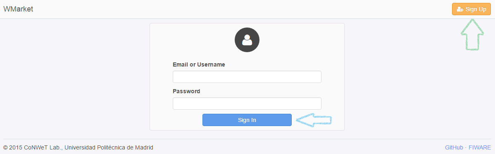

If it is your first time in this instance, you have to create a new account.
To do so, just click the **Sign up** button (the once indicated by the green 
arrow). Otherwise, introduce your credentials (your email and your password)
and click the **Sign in** button (the one indicated by the blue arrow). 

To create a new account, you will be required to introduce some details: 

* **Full Name:** your complete full name. It must contain between 3 and 30 
  characters. Only letters and spaces are accepted.
* **Email:** your email address. It must be a valid email address according
  to the email pattern. Two users cannot use the same email address.
* **Password:** password to access your account. It must contain between 8 and
  30 characters. It must contain one number, one letter and one special 
  character (``!``, ``#``, ``$``, ``%``, ``&`` and ``?``).

.. note::
  If the user cannot be created because one or more fields are invalid, these
  fields will be highlighted in red colour and a message will be attached to 
  every invalid field so the user can understand why these fields are invalid.

Once that you have introduced these details, just click **Create**.

.. image:: images/user-guide/register_user.png
   :align: center

.. note::
  When using the local authentication system, you can log in using your email
  or your user name. This user name is based on your full name and you can get
  it in the profile management page as will be explained below. 

Managing User Profile
`````````````````````

Once that you are logged in, you will be redirected to the WMarket main page 
where you will be able to find all the provided offerings. To manage your 
profile, just click in your user name on the upper right corner (the button 
indicated by the blue arrow) and then click the **Settings** button (the one 
indicated by the green arrow).

.. image:: images/user-guide/user_settings_button.png
   :align: center

.. note::
  As can be seen, you can log out by clicking **Log out** button (the one 
  indicated by the black arrow).

When you click on **Settings**, you are redirected to the profile management 
page.

.. image:: images/user-guide/profile_management.png
   :align: center

If the instance is using the local authentication system, this page will allow
you to:

* Change your personal information
* Become a provider
* Change your password
* Delete your account

If you want to change your personal information, just type your new details
into the **Personal Information** box (the one rounded with a blue rectangle)
and click the **Save Changes** button.

.. note::
  As can be seen, the **Personal Information** box contains your user name. 
  As stated before, you can also use this user name to log in.

You will also be able to become a provider in order to enable new options to 
create stores and publish offerings. To do so, just click the **I want to 
become a provider** button located within the green box. If you are already a
provider and you just want to be a simple consumer, just click the **I don't
want to be a provider anymore** button.

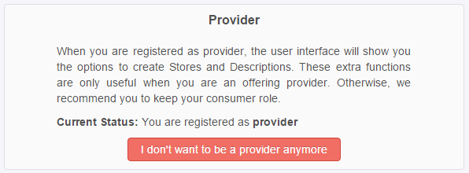

To change your password, click the **Credentials** button (the one indicated by
the black arrow). Then, you will be redirected to a new page that will allow 
you to change your password. In this page, just write your old password and
type twice your new password. If your old password is correct and the new
password fits the password requirements, your password will be changed.

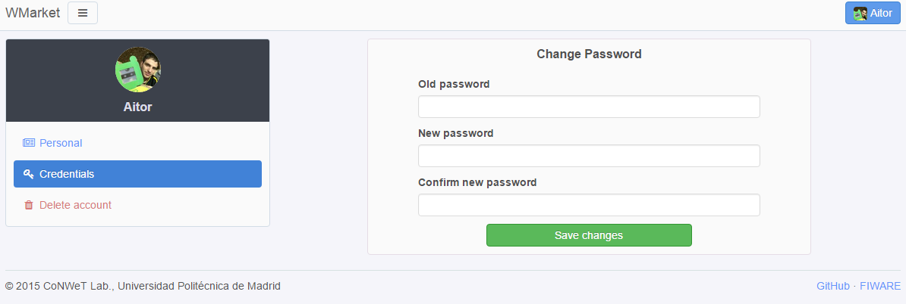

.. note::
  When you change your password, the system will close your session so you will
  be required to log in again.

Finally, you can also deleted your account. To do so, just click the **Delete
account** button (the one indicated by the red button). You will be required to
confirm the operation as can be seen in the following image.

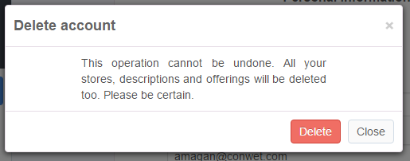

.. note::
  When you delete your account, all your content (reviews, stores, offerings, 
  descriptions...) will be deleted.

Browsing Offerings
------------------

When you access WMarket, you are redirected to the main page. 

.. image:: images/user-guide/main.png
   :align: center

This page is divided into three parts:

* **Other users are looking at** (red box): shows offerings viewed by other
  users.
* **Last viewed** (blue box): shows the last offerings viewed by you.
* **Categories** (green box): shows offerings divided by their category.
  You can click the name of any category to retrieve the full list of offerings
  contained in this category.

Offering Details
````````````````

You can click any offering to view its details. 

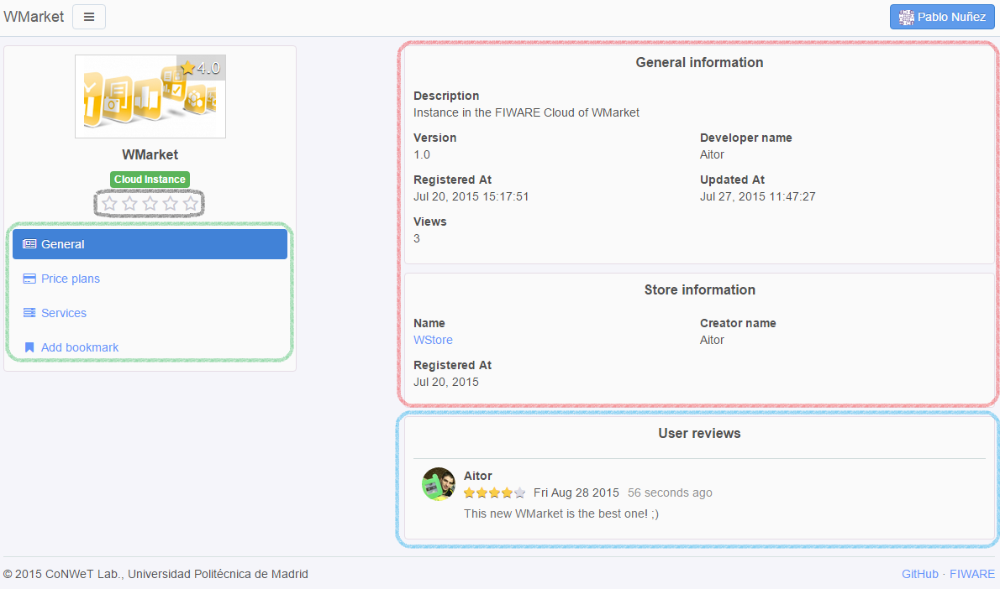

This page is divided in different zones:

* The **red box** contains general information about the offering: name, 
  version, description, provider...
* The **blue box** contains the reviews mage by users.
* The **green box** contains all the actions that you can do with the offering:
  view its price plans, view its services or add it you to your bookmarks. 
* The stars indicated by the **black arrow** can be used to review the 
  offering.
* The button indicated by the **purple arrow** will open in a new window (or 
  tab) the Store page where the offering can be acquired.

To view all the price plans included in an offering, just click the **Price 
Plans** button. 

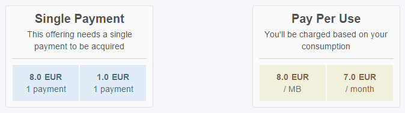

To view all the services included in an offering, just click the **Services** 
button.

.. image:: images/user-guide/offering_services.png
   :align: center

Reviewing Offerings
```````````````````

If you want to review an offering, you can easily do it by clicking one of the
stars contained in the black box. The first star means that you do not like the
offering while the last one means that you really like the offering. You should
click on the appropriate star according to your thoughts. 

Once that you have clicked a star, a new dialog will be opened asking for an
extended review as can be seen in the following picture.

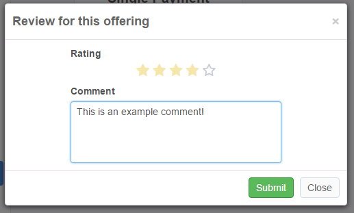

In this dialog you can change the number of stars and add a brief comment to 
explain your decision. When you have completed the review, just click the
**Submit** button. 

Once that you have reviewed an offering, you can edit or delete your review. 
To do so, just click one of the stars contained in the black box. A new dialog
will be opened with your review. 

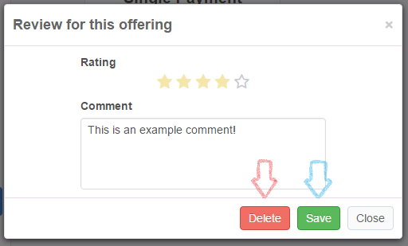

To update your previous review, just modify the number of stars and type a new
comment. Then, click the **Save** button (the one indicated by the blue arrow).
On the other hand, if you want to delete your review, just click the **Delete**
button (the one indicated by the red arrow).

Bookmarking
```````````

To add an offering to your bookmarks, just click the **Add bookmark** button
(contained in the green box). The button will change to **Remove bookmark** so
you will be able remove this offering from your bookmarks.

.. image:: images/user-guide/remove_bookmark.png
   :align: center

To view the list of bookmarked offerings, you can click the menu button that is
next to the **WMarket** text on the left upper corner as can be seen in the 
following image.

.. image:: images/user-guide/contextual_menu.png
   :align: center

Then click the **My Bookmarks** button (the one indicated by the blue arrow).
A screen similar to the following one will be displayed.

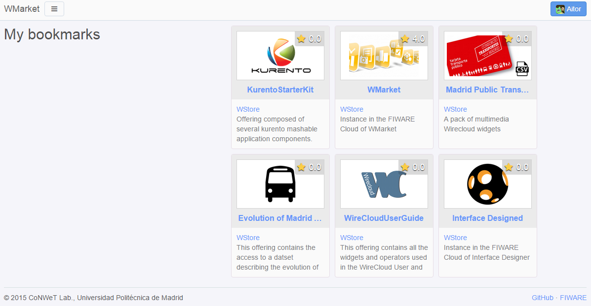

You can click any offering to obtain extended details about the offering.

Comparing Offerings
-------------------

WMarket allows users to compare different offerings. To do so, click the menu
button that is next to the **WMarket** text on the left upper corner (as can be
seen in the following image) and click the **Compare offerings** button (the
one indicated by the green arrow).

.. image:: images/user-guide/contextual_menu.png
   :align: center

You will be redirected to a new page that will allow you to create comparisons.

.. image:: images/user-guide/comparisons.png
   :align: center

To compare offerings, just look for the offerings that you want to compare in
the **Select any offering for comparison** section (the one rounded with a blue
rectangle) and click them. Offerings will appear in the **Compare Offerings** 
section (the one rounded with a green rectangle) as you click them. 

To remove any offering from the comparison, just click on its picture (the
one contained in the red rectangle).

The comparison will show you:

* The name and the image of each offering.
* A link to acquire each offering.
* The description of each offering.
* The categories of each offering. Categories will be ordered and aligned in 
  order to highlight the difference of categories between the compared 
  offerings.
* The price plans of each offering (ordered alphabetically).
* The services of each offering. Services will be ordered and aligned in order
  to highlight the difference of services between the different offerings.

Browsing Stores
---------------

Apart from retrieving all the registered offerings, you can also get the 
offerings that are included in a certain Store. To do so, click the menu button
that is next to the **WMarket** text on the left upper corner (as can be seen
in the following image) and click on one of the registered stores.

.. image:: images/user-guide/contextual_menu.png
   :align: center

Once that you click on one store, you will see a screen similar to the 
following one:

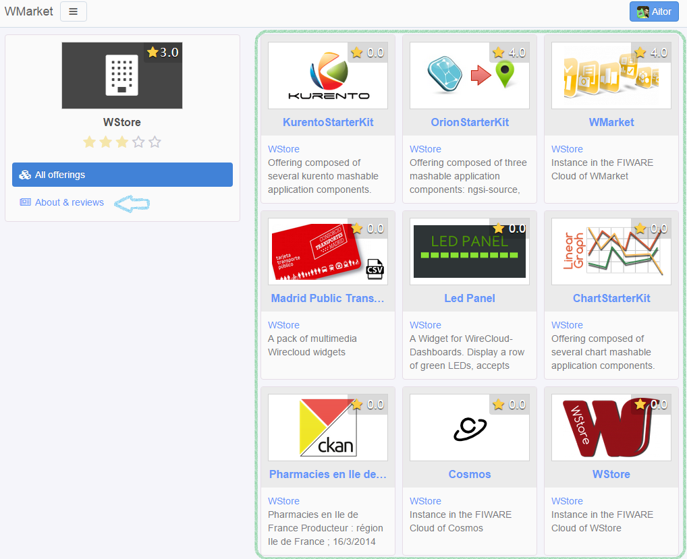

The area rounded by the green rectangle contains all the offering registered in
this Store. 

To retrieve the details about the Store and its review, just click the **About 
& reviews** button (the one indicated by the blue arrow). You will be 
redirected to the following page.

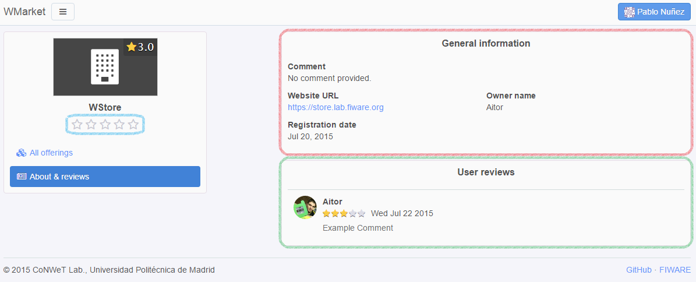

The **General Information** box (the one rounded with the red rectangle) 
contains general information about the Store (comment, web site, creator and
registration date) while the **Users review** box (the one rounded with the 
blue rectangle) contains all the reviews made by users. 

Reviewing Stores
````````````````

If you want to review a store, you can easily do it by clicking one of the
stars contained in the blue box. The first star means that you do not like the
store while the last one means that you really like the store. You should
click on the appropriate star according to your thoughts. 

Once that you have clicked a star, a new dialog will be opened asking for an
extended review as can be seen in the following picture.


In this dialog you can change the number of stars and add a brief comment to 
explain your decision. When you have completed the review, just click the
**Submit** button. 

Once that you have reviewed the store, you can edit or delete your review. 
To do so, just click one of the stars contained in the blue box. A new dialog
will be opened with your review. 


To update your previous review, just modify the number of stars and type a new
comment. Then, click the **Save** button (the one indicated by the blue arrow).
On the other hand, if you want to delete your review, just click the **Delete**
button (the one indicated by the red arrow).


Providers
=========

As explained before, providers are those users who want to create stores and
upload offerings to WMarket. To become a provider, you can refer to the 
:doc:`administration-guide`.

Stores Management
-----------------

Creating Stores
```````````````

To register a new store, click in the menu button that is next to the 
**WMarket** text on the left upper corner (as can be seen in the following 
image) and click on the **Register a new store** button (the one indicated by
the blue arrow). 

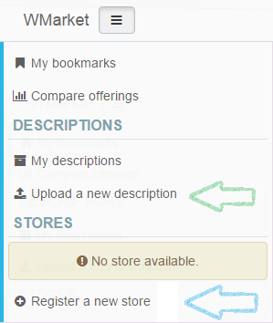

The following screen will be opened:

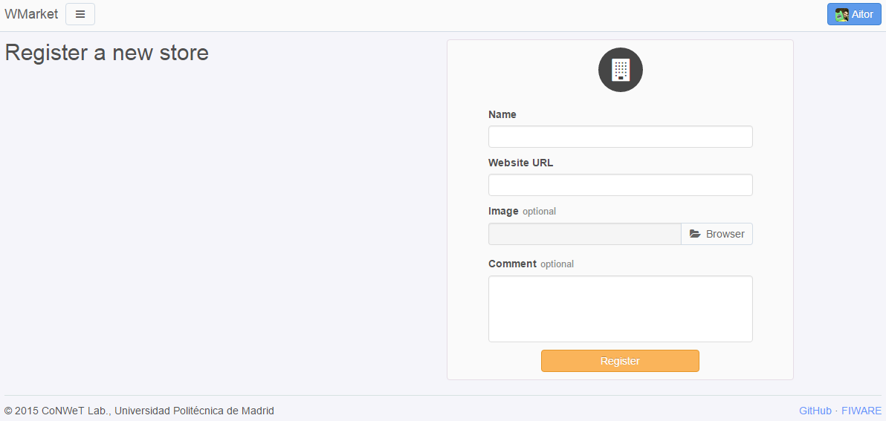

Introduce the following content:

* **Name:** The name of the Store. It must contain between 3 and 100 
  characters. Only letters, numbers, white spaces, dots and hyphens are
  accepted.
* **Website URL:** The URL where the store is hosted. The URL must be valid.
* **Image:** An image that will ease the process of identifying your store. 
  You can upload it from your computer. The maximum size accepted (by default) 
  is 3 MB.
* **Comment:** A brief description of your store. You can type until 200
  characters.

.. note::
  If the store cannot be created because one or more fields are invalid, these
  fields will be highlighted in red colour and a message will be attached to 
  every invalid field so the user can understand why these fields are invalid.

If you have introduced these fields correctly, you will be redirected to the
main page of the Store, where you will be able to manage it. 

.. image:: images/user-guide/store_main_provider.png
   :align: center

Managing Existing Stores
````````````````````````

To view all the descriptions that you have uploaded to the Store, click the 
**My descriptions** button (the one indicated by a green arrow). A screen 
similar to the following one will be displayed:

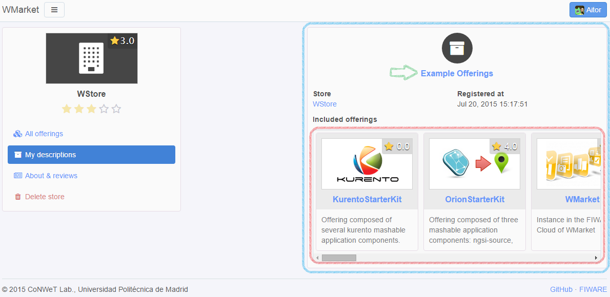

You can click on the name of the description to manage it as will be explained
later.

To edit the details of your store, just click the **About & reviews** button
(the one indicated by a blue arrow). Only store creators can edit its details. 
When you click this button, the following screen will be shown:

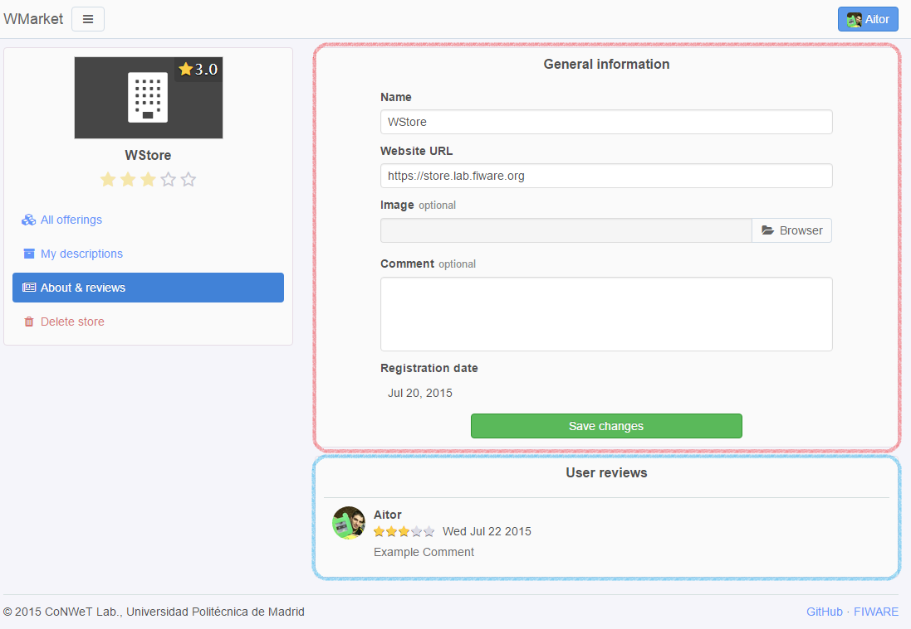

The area rounded by the red rectangle is the one that you should use to modify
your store details. Introduce new details as desired and click the **Save 
changes** button when finished. The area rounded by the blue rectangle contains
all the reviews that your store have received.

To delete your store, click the **Delete Store** button (the one indicated by
the red arrow). Only the store creator can delete it. Before deleting the 
store, you have to confirm the operation in the following dialog:

.. image:: images/user-guide/delete_store_dialog.png
   :align: center

.. note::
  When you delete a store, all its descriptions, offerings and reviews will be
  deleted. 

Descriptions Management
-----------------------

Descriptions are the definitions of your offerings. These descriptions are 
written in `Linked USDL <http://linked-usdl.org/>`__.

Creating Descriptions
`````````````````````
To register a new description, click in the menu button that is next to the 
**WMarket** text on the left upper corner (as can be seen in the following 
image) and click on the **Upload a new description** button (the one indicated
by the green arrow). 


Once that you have clicked the button, you will be redirected to the following
page:

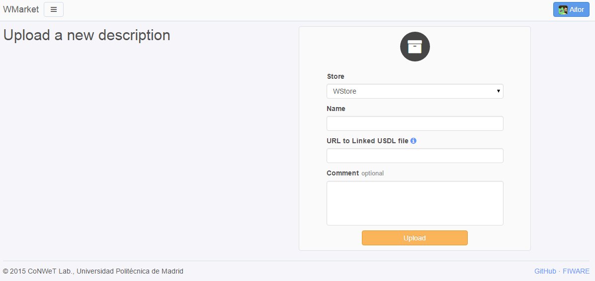

To create the description, set the following details:

* **Store:** The store where you want to upload the description.
* **Name:** The name to give to your description. It must contain between 3 and 
  100 characters. Only letters, numbers, white spaces, dots and hyphens are
  accepted.
* **URL to Linked USDL file:** the HTTP URL where your description is hosted.
  This URL must exist and contain a valid Linked USDL file. Otherwise, the 
  description creation will fail.
* **Comment:** A brief comment about the description you are uploading. You can 
  type until 200 characters.

.. note::
  If the description cannot be created because one or more fields are invalid,
  these fields will be highlighted in red colour and a message will be attached 
  to every invalid field so the user can understand why these fields are 
  invalid.

Once that you have completed the form, the description will be created and all
the contained offerings will be loaded into the corresponding store and you 
will be redirected to the page that contains all the offerings of this store.

.. image:: images/user-guide/store_main_provider.png
   :align: center

Managing Existing Descriptions
``````````````````````````````

To manage all the descriptions that you have upload to this store, you can 
click the **My Descriptions** button (the one indicated by a green label). A
screen similar to the following one will be shown:


For each description a box similar to the blue one will appear. As you can see,
the red box contains all the offerings attached to this description. To manage
the description click on its name (the button indicated by the green arrow).

.. note::
  If you have uploaded a description but you do not remember the Store that
  you have used to publish the offerings, you can view all the uploaded 
  descriptions by opening the menu and clicking the **My Descriptions** button.

When you click on the name, you will see a page similar to the following one:

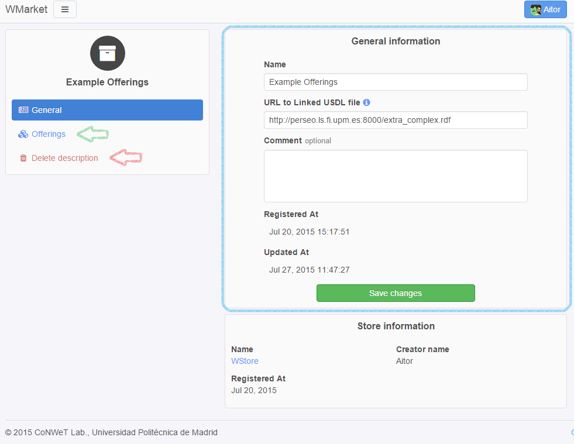

If you want to edit the description details, you can use the form contained in
the blue rectangle. Once that you have finished editing the description, click
the **Save changes** button.

To view all the offerings contained in the offering, click the **Offerings** 
button (the one indicated by a green arrow). You will be displayed a screen
similar to the following one:

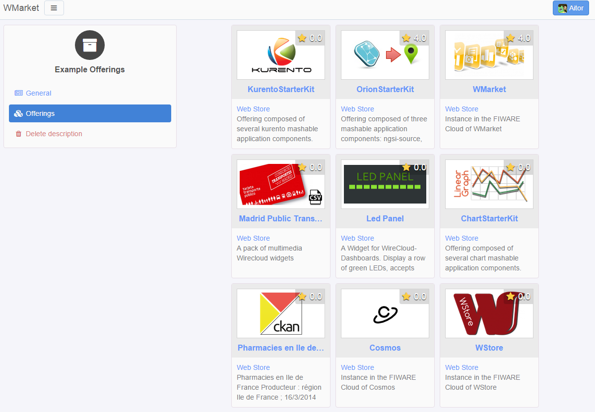

Finally, if you want to delete a description, just click the **Delete 
description** button. Before deleting the description, you will be required to
confirm the action with a dialog similar to the following one:

.. image:: images/user-guide/delete_description_dialog.png
   :align: center

.. note::
  By deleting a description, you will delete all the attached offerings (and
  its reviews or statistics).

.. note::
  Descriptions are periodically updated to check whether new offerings have
  been included. 


----------------
Programmer Guide
----------------

You can check the API Reference on
`Apiary <http://docs.fiwaremarketplace.apiary.io>`__
